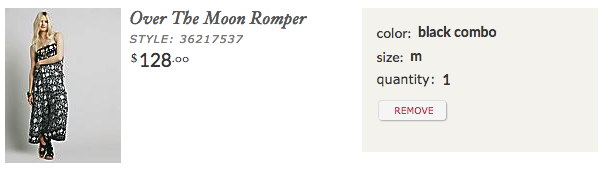

## Angular Developer Interview Repository

This is a simple skeleton app used for interviews for Urban Outfitter's Angular JS developer positions.  It is intended to be a starting point for you to build on top of.

This skeleton was created with the Yeoman [gulp-angular](https://github.com/Swiip/generator-gulp-angular) generator so please refer to that documentation for any build process questions.  It provides the following gulp tasks:

 - gulp - Build the project
 - gulp watch - Launch a watcher to recompile the app from your sources
 - gulp serve - Serve the app at http://localhost:3000
 - gulp test - Execute app unit tests using Karma/Jasmine

### Getting up and running:

 - Clone this repository ([instructions](https://help.github.com/articles/fork-a-repo/))
 - Run `gulp` to build the project
 - In one terminal window, run `gulp watch` to launch a watcher to recompile source files as they change
 - In a separate terminal window, run `gulp serve` to launch the web server, which should open up the skeleton app at http://localhost:3000
 - Implement the steps outlined below in a branch.  Use incremental commits as possible to show how you arrived at your solution
 - Push your story branch to your fork
 - Issue a [pull request](https://help.github.com/articles/using-pull-requests/) against this repo's master branch

### Assignments

Please perform each step in sequence, and commit them individually.  You are free to do smaller commits along the way, but just indicate in the commit message which commit contain the finished code for each step.  For example, the following flow would be fine:

 - Commit 1: ...
 - Commit 2: ...
 - Commit 3: Step 1 complete - [commit notes]
 - Commit 4: ...
 - Commit 5: Step 2 complete - [commit notes]
 - ... and so on

### Steps

 1. Create a `Products` service in a new file (`products.service.js`) and implement a `getProducts()` method that fetches the `data/products.json` file using Angular's `$http` service.  The function should return a promise resolved with the products array, or rejected with a string error message.
 2. On the products page, render a simple unordered list of products using the `Products.getProducts()` method.  This should just be one line per product of "[styleNumber] - [displayName]".  Do not worry about any styling in this step.
 3. Enhance the product display by creating a `<product product="productObject">` directive (new file `product.directive.js`) that can render a product according to the styles shown in the sample image below.  Do not focus on pixel perfect styles or different fonts, just worry about bold, italics, etc.  Feel free to use the bundled foundation grid system, via standard CSS classes or via SCSS mixins, or to write your own CSS styles.  Do not worry about the Remove button functionality in this step.
 4. Enhance the `Products.getProducts()` method to cache the resulting products and return the cached copy for the duration of the app.
 5. Add a `Products.removeProduct(id)` method that will remove a given product from the cached product data, and wire it up to the remove button.

##### Sample product styling:

#### Bonus point ideas:
1. Unit tests :)
2. Add an `input` text box and search `button` to the top of the product list that will filter the list based on the search text whenever the search button is clicked.
3. Add some CSS animations on removing/filtering using `ngAnimate` and corresponding `ngRepeat`/`ngHide` CSS classes
4. Or anything else you think would be a neat addition!

